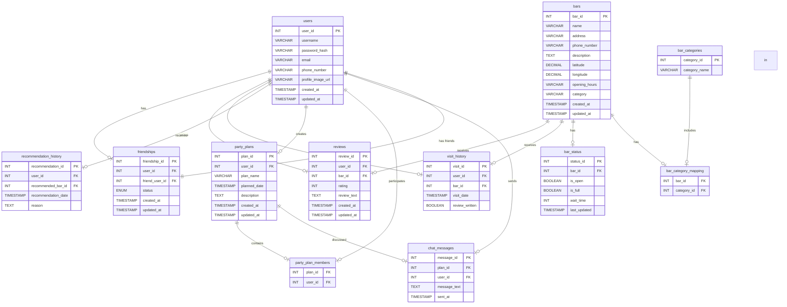

```mermaid
erDiagram
    users {
        INT user_id PK
        VARCHAR username
        VARCHAR password_hash
        VARCHAR email
        VARCHAR phone_number
        VARCHAR profile_image_url
        TIMESTAMP created_at
        TIMESTAMP updated_at
    }

    friendships {
        INT friendship_id PK
        INT user_id FK
        INT friend_user_id FK
        ENUM status
        TIMESTAMP created_at
        TIMESTAMP updated_at
    }

    bars {
        INT bar_id PK
        VARCHAR name
        VARCHAR address
        VARCHAR phone_number
        TEXT description
        DECIMAL latitude
        DECIMAL longitude
        VARCHAR opening_hours
        VARCHAR category
        TIMESTAMP created_at
        TIMESTAMP updated_at
    }

    reviews {
        INT review_id PK
        INT user_id FK
        INT bar_id FK
        INT rating
        TEXT review_text
        TIMESTAMP created_at
        TIMESTAMP updated_at
    }

    visit_history {
        INT visit_id PK
        INT user_id FK
        INT bar_id FK
        TIMESTAMP visit_date
        BOOLEAN review_written
    }

    recommendation_history {
        INT recommendation_id PK
        INT user_id FK
        INT recommended_bar_id FK
        TIMESTAMP recommendation_date
        TEXT reason
    }

    bar_status {
        INT status_id PK
        INT bar_id FK
        BOOLEAN is_open
        BOOLEAN is_full
        INT wait_time
        TIMESTAMP last_updated
    }

    bar_categories {
        INT category_id PK
        VARCHAR category_name
    }

    bar_category_mapping {
        INT bar_id FK
        INT category_id FK
    }

    party_plans {
        INT plan_id PK
        INT user_id FK
        VARCHAR plan_name
        TIMESTAMP planned_date
        TEXT description
        TIMESTAMP created_at
        TIMESTAMP updated_at
    }

    party_plan_members {
        INT plan_id FK
        INT user_id FK
    }

    chat_messages {
        INT message_id PK
        INT plan_id FK
        INT user_id FK
        TEXT message_text
        TIMESTAMP sent_at
    }

    %% Relationships
    users ||--o| friendships : has
    users ||--o| reviews : writes
    users ||--o| visit_history : visits
    users ||--o| recommendation_history : receives
    users ||--o| party_plans : creates
    users ||--o| party_plan_members : participates
    users ||--o| chat_messages : sends

    friendships ||--|| users : "has friends"
    bars ||--o| reviews : receives
    bars ||--o| visit_history : receives
    bars ||--o| bar_status : has
    bars ||--o| bar_category_mapping : has
    bar_categories ||--o| bar_category_mapping : includes
    party_plans ||--o| party_plan_members : contains
    party_plans ||--o| chat_messages : discussed in

```

